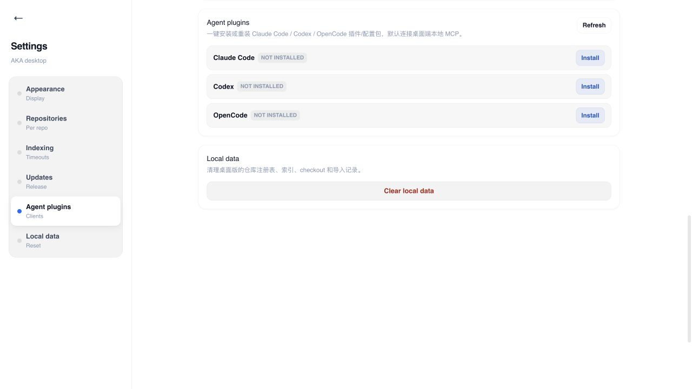

# AKA 新手使用指南

这份指南适用于第一次安装 AKA 桌面端后的设置。完成下面两件事后，就可以在桌面端浏览代码图谱，也可以让 Claude Code、Codex 或 OpenCode 复用同一套本地索引。

1. 安装一个 Agent 集成包。
2. 添加并完成第一个代码仓库的索引。

## 开始前

- 从 [Releases](https://github.com/caork/aka-releases/releases) 下载并安装适用于当前平台的正式 AKA 桌面端。
- 启动 AKA。使用 Agent 集成时，请保持 AKA 桌面端运行；集成包连接的是本机的 AKA 服务，不会上传代码仓库。
- 准备好要索引的项目根目录、可访问的 Git URL，或包含项目根目录的 `.zip` 文件。

## 1. 认识首次启动界面

首次启动时，中间会显示“还没有仓库”。左下角是 AKA 图标；将鼠标停留在图标上，可打开仓库菜单。

在菜单中选择 **Add repository**，就会打开添加仓库窗口。首次使用建议先索引一个本地项目，确认界面与检索工作正常后，再按需要添加远程 Git 仓库。

## 2. 安装 Agent 集成包

AKA 提供 Claude Code、Codex 与 OpenCode 的一键集成。它们共用 AKA 桌面端的本地 MCP 服务和索引，因此不需要为每个 Agent 重复导入同一个仓库。

1. 点击左下角的 AKA 图标，打开 **Settings**。
2. 在左侧选择 **Agent plugins**。
3. 点击右上角 **Refresh**，读取当前安装状态。
4. 在目标客户端所在行点击 **Install**。已经安装过时，按钮会显示为 **Reinstall**。
5. 完成后重启对应客户端：Claude Code 可使用 `/reload-plugins` 或重启；Codex 请新开一个会话；OpenCode 请重启应用或会话。

安装会只写入 AKA 管理的客户端配置，并将客户端连接到 `http://127.0.0.1:4112/mcp`。若客户端显示无法连接，请先确认 AKA 桌面端仍在运行，再执行一次 **Refresh** 检查安装状态。

## 3. 添加并索引代码仓库

将鼠标停留在左下角 AKA 图标上，选择 **Add repository**。在弹出的窗口中选择一种来源：

| 来源 | 何时使用 | 操作 |
| --- | --- | --- |
| **本地路径** | 项目已经在当前电脑上 | 选择 **本地路径**，点击“选择仓库文件夹”，选择项目根目录，然后点击“导入”。 |
| **Git** | 需要让 AKA 克隆远程仓库 | 选择 **Git**，填写可访问的 `Git URL`；“名称”可选，然后点击“导入”。私有仓库需要使用当前电脑已经可用的 Git 凭据。 |
| **Zip** | 收到的是代码压缩包 | 选择 **Zip**，选择 `.zip` 文件并填写名称。压缩包的顶层应是代码仓库根目录，然后点击“导入”。 |

导入成功后，窗口会关闭，新仓库会立即出现在左下角的仓库菜单中，并显示 `indexing` 状态。AKA 会在后台建立代码结构、搜索和图谱索引。

索引期间请不要把空搜索结果当成最终结果。等待仓库状态从 `indexing` 变为可用后，再开始使用：

- **Code**：浏览目录和源码，或使用右上角搜索入口查找符号与代码。
- **Graph**：查看目录、文件、符号及其关系。
- **Agent**：先让客户端调用 `list_repos`；看到仓库已就绪后，再让它查询、查定义或分析影响范围。

## 常见问题

### Agent 显示未连接

保持 AKA 桌面端运行，然后回到 **Settings > Agent plugins** 点击 **Refresh**。确认目标客户端显示为已安装后，重启该客户端或新开会话。

### Git 仓库导入失败

确认 Git URL 可以在这台电脑上访问；私有仓库还需要当前账户已有可用的 SSH key、凭据管理器或其他 Git 认证方式。修正后重新添加仓库。

### 仓库长时间停在 `indexing` 或显示失败

先确认选择的是项目根目录而不是构建产物目录，并检查该目录或 Git 仓库在本机可读。若状态显示失败，请查看仓库设置中的错误信息，修正访问或项目问题后再更新或重新导入。
