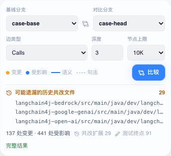
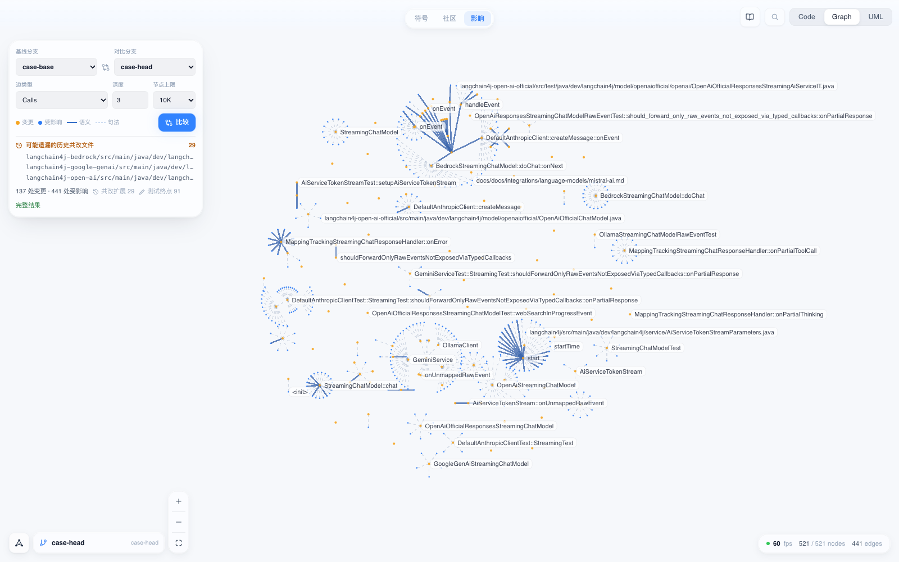
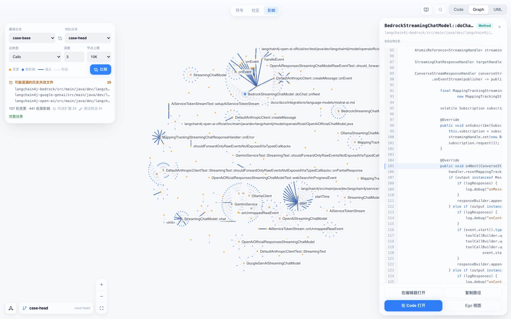
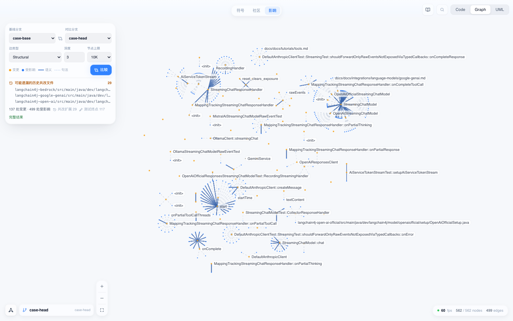

# 变更影响分析

变更影响分析回答一个问题：把一个分支合进另一个分支，除了 diff 里列出的文件，还有哪些代码和测试会被牵动。AKA 读取两个分支各自的索引快照，在符号图上从每个改动点反向传播到调用方，再补上词法命中和历史共改证据，最后给出一份带证据来源和结论强度的清单。

这不是 diff 查看器。diff 告诉你改了什么，影响分析告诉你还要看什么、还要跑哪些测试。

## 使用前提

影响分析需要三个条件同时成立。

1. 仓库以 git 方式注册在 AKA 里。压缩包导入的仓库没有分支，无法比较。
2. 基线分支和对比分支**都已经索引过**。AKA 按分支保存快照，每个分支各自发布一份不可变 generation；没有快照的分支不会出现在下拉框里，也无法作为比较的一侧。
3. 两侧快照都是最新的。分支上出现新提交后需要重新索引，否则该分支会被拒绝读取并提示快照过期。

索引某个分支的方法是在界面右上角的分支下拉框里选中它，AKA 会为该分支建立或更新快照。两个分支都处理过之后，比较才能给出「完整结果」而不是下界。

## 操作步骤

进入 **Graph** 视图，顶部有 **符号 / 社区 / 影响** 三个图层，点 **影响**。左侧出现比较面板。



**选择两侧分支。** 「基线分支」是要合入的目标分支，「对比分支」是待合入的分支。比较采用三点语义（`base...head`）：从两个分支的共同祖先算起，只统计对比分支自己引入的改动，目标分支上其他人的提交不会混进来。这与合并请求页面显示的 diff 是同一套口径。比较过程只读取两侧的 blob 和快照，不会切换工作区、不会动本地文件。

**设定传播参数。** 「边类型」决定沿哪些关系传播，「深度」是最大跳数，「节点上限」是单次响应的节点预算。默认组合是 Calls、深度 3、10K，适合绝大多数评审场景。

**点「比较」。** 结果同时呈现在图上和面板底部。



图上橙色是变更点，蓝色是受影响点，实线代表语义边，虚线代表句法边。每个变更点带着自己的传播子树，子树深度就是跳数。点任意节点会在右侧展开该节点在对应快照下的源码，行号和高亮直接落在符号定义上。



## 结果的四个部分

### 变更清单与变更分类

AKA 对每个改动的符号做两侧比对，给出五种分类。分类不只是标签，它直接决定这个改动传播多远。

| 分类 | 含义 | 传播距离 |
| --- | --- | --- |
| 新增 | 对比分支上新出现的符号 | 1 跳 |
| 函数体变更 | 签名不变，实现变了 | 1 跳 |
| 签名变更 | 参数、返回类型或可见性变了 | 直到设定深度 |
| 删除 | 基线分支上存在、对比分支上消失 | 直到设定深度 |
| 仅注释或格式 | 语义指纹未变 | 不传播 |

签名变更和删除同时被标记为**破坏性**改动。这两类会破坏调用方的编译或行为，所以传播到设定的最大深度；新增和函数体变更只影响直接调用方，一跳即止；只动了注释或空白的符号不产生任何影响项。删除的符号在**基线分支**的图上查找调用方——这也是两侧都需要索引的原因之一。

### 影响集合与传播路径

结果不是一张诱导子图，而是一片保留路径的传播森林：每个受影响节点只保留它被发现时所经过的那条父边。这样每个结论都能回答「它为什么在这里」，同时边数与节点数同阶，大结果也画得动。

### 证据来源与结论强度

每个受影响项都带一个证据来源：

- **语义**（`graph:semantic`）——来自上游 SCIP 索引器解析出的真实符号引用，最强。
- **句法**（`graph:syntactic`）——来自内置解析器的名称级关系，可能有同名误配。
- **词法**（`lexical`）——名称在代码里被检索到并经快照验证，用于图上没有连边的场合，例如文档、配置和反射调用。
- **共改**（`cochange`）——历史上与改动文件频繁一起提交的文件。

面板左下角显示整体结论强度：**完整结果**表示两侧快照齐备、传播未被截断，清单可以按完整集合读；**下界**表示存在已知盲区，实际影响面可能更大。降级为下界的常见原因包括某一侧没有索引快照、传播被节点预算截断、词法候选验证被预算截断、以及部分改动的符号在快照里找不到对应节点。降级原因会随结果一并返回，不需要猜。

### 盲区补齐

图和词法都覆盖不到的地方，由两项历史证据兜底。

- **共改扩展**把历史上与本次改动文件高度同步提交的文件加进影响集合，标注为共改证据。
- **可能遗漏的历史共改文件**是一份提醒清单：这些文件通常和你改的文件一起改，但这次没在 diff 里。面板会把它们单列出来。
- **测试终点**统计影响面里按命名约定识别出的测试文件数量，也就是这次改动至少应该跑的测试范围。

## 案例：langchain4j 暴露未映射的原始流式事件

### 案例来源

[langchain4j](https://github.com/langchain4j/langchain4j) 的合并请求 #5589「Expose unmapped raw streaming events」，单个提交 `194b86421`，改动 29 个文件。这个改动在 `langchain4j-core` 里给流式响应处理器加了一个新的回调入口，然后各家模型接入层需要跟着把原始事件透出来。它是一个典型的「核心接口动一下，外围一大片跟着动」的改动，很适合检验影响分析。

案例把合并前的提交打成 `case-base` 分支、合并后的提交打成 `case-head` 分支，两侧分别用官方 `scip-java` 做语义索引后再比较。仓库在 `case-head` 上共有 3,535 个受版本控制的文件。

### 完整回放

把两个分支直接交给影响分析，参数是边类型 Calls、深度 3、节点上限 10K：

- **137 处变更 · 441 处受影响**，共改扩展 29，测试终点 91，结论强度为**完整结果**。
- 变更分类分布：新增 78、函数体变更 46、仅注释或格式 12、签名变更 1。
- 证据分布：语义 73、词法 339、共改 29。

把边类型换成 Structural，同样的 137 处变更传播出 **499 处受影响**，测试终点从 91 涨到 117。



### 预测实验

完整回放会把 PR 自己改过的文件也算作变更点，说明不了预测能力。所以做第二个实验：**只把这次改动中 4 个核心接口文件交给影响分析**，两侧分支仍然提供 blob 和快照（保证分类精确），看它能不能找出 PR 实际改的其余 25 个文件。

作为输入的 4 个文件：

```
langchain4j-core/src/main/java/dev/langchain4j/internal/InternalStreamingChatResponseHandlerUtils.java
langchain4j-core/src/main/java/dev/langchain4j/internal/MappingTrackingStreamingChatResponseHandler.java
langchain4j-core/src/main/java/dev/langchain4j/model/chat/StreamingChatModel.java
langchain4j-core/src/main/java/dev/langchain4j/model/chat/response/StreamingChatResponseHandler.java
```

需要预测的是剩下 25 个文件，其中 10 个是测试文件。结果如下（深度 3、节点上限 10K）：

| 边类型 | 给出的文件数 | 命中 | 召回 | 测试文件命中 | 相对全仓的缩减 |
| --- | ---: | ---: | ---: | ---: | ---: |
| Calls | 97 | 21 / 25 | 84.0% | 7 / 10 | 97.3% |
| Structural | 115 | **25 / 25** | **100%** | **10 / 10** | 96.7% |

Structural 把 3,535 个文件缩小到 115 个，PR 实际改的另外 25 个文件全部落在这 115 个里面，包括全部 10 个测试文件。精确率是 21.7%——影响分析给出的是需要复核的范围，不是一份必改清单。

Calls 漏掉的 4 个文件解释了边类型的作用。其中 `AiServiceStreamingResponseHandler.java` 之所以漏掉，是因为它只通过 `IMPLEMENTS` 连到被改的接口，而 Calls 边类型不走继承与实现关系；另外 3 个是依赖它的测试文件。把边类型放宽到 Structural，这条实现关系就被纳入，漏掉的 4 个文件全部补齐。

### 证据强度的影响

如果只保留图证据、丢掉词法和共改证据，Structural 给出 49 个文件，命中 21 / 25，精确率升到 42.9%，测试文件仍然是 10 / 10；漏掉的是两个 Markdown 教程文档和两个通过转发关系间接受影响的服务类文件。图证据更准，词法与共改证据负责把文档和图上没有连边的地方捞回来——这正是清单区分证据来源的意义。

## 边类型的选择

| 边类型 | 传播的关系 | 适用场景 |
| --- | --- | --- |
| Calls | 仅调用关系 | 默认。函数体改动、局部重构、日常评审 |
| Calls + imports | 调用加导入 | 改动跨模块，想看哪些文件在引用它 |
| Structural | 再加继承、实现、覆写、成员归属等结构关系 | 改接口、抽象类、被广泛实现的回调；本案例即属此类 |
| Full | 全部已知边类型 | 排查疑难，或需要最保守的上界 |

选择原则是从 Calls 开始。当改动落在接口、抽象类或注解上，或者结果里明显缺了实现类，就升到 Structural。边类型越宽，召回越高、精确率越低，需要人复核的范围也越大。

深度的取值同理。默认 3 已经能覆盖大多数评审；破坏性改动（删除、签名变更）本来就会传播到设定的最大深度，调大深度主要影响的就是这两类。

## 常见问题

**分支下拉框里找不到某个分支。** 该分支还没有索引快照。在界面右上角的分支下拉框选中它，等待索引完成后再回到影响图层。

**结果显示「下界」而不是「完整结果」。** 面板会给出降级原因。最常见的是某一侧分支没有索引快照，或者结果达到了节点上限。前者补索引即可；后者可以调小深度、收紧边类型，或提高节点上限。

**受影响的文件里有一堆看起来不相关的东西。** 检查证据来源。词法证据是按名称检索并经快照验证得到的，常见符号名（例如 `start`、`onNext`）会带来噪声。需要更保守的清单时，按语义证据筛选。

**影响分析会不会改动我的工作区。** 不会。比较只读取两侧分支的 blob 和已发布的快照，全程不切换分支、不写工作区文件。

**结果里的源码是哪个版本。** 快照钉住的版本。点开受影响节点看到的源码来自对应分支的那一份不可变 generation，不是当前磁盘上的内容，所以比较结果和你看到的代码始终一致。
